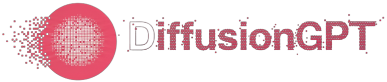

<div align="center">


### A Discrete Diffusion Language Model for Conversational AI

[](https://opensource.org/licenses/MIT)
[](https://huggingface.co/JorgeVanco/diffusionGPT)

[**Quick Start**](#quick-start) • [**Documentation**](#features) • [**Research**](#research-background) • [**Training**](#training)

---

</div>

## Overview

**diffusionGPT** is a novel language model that generates text through iterative refinement rather than sequential prediction. Unlike traditional autoregressive models (GPT, Llama) that generate text left-to-right one token at a time, diffusionGPT uses a **discrete diffusion process** to simultaneously denoise and refine entire sequences.

This approach enables:
- **Parallel token generation** across the sequence
- **Creative text editing** and refinement capabilities
- **Flexible generation modes** (standard and semi-autoregressive)
- **Interpretable generation** - watch the model "think" in real-time

### See It In Action

> *[Video demonstration will be embedded here]*

Watch as diffusionGPT iteratively refines masked tokens into coherent text through a beautiful denoising process.

---

## Features

### Parallel Decoding
Unlike autoregressive models that must generate tokens sequentially, diffusionGPT generates and refines multiple tokens simultaneously, allowing for more flexible and potentially faster generation strategies.

### Seed Diffusion Editing
Implements advanced editing logic from [Seed Diffusion (arXiv:2508.02193)](https://arxiv.org/abs/2508.02193), enabling the model to refine and improve existing text while maintaining semantic coherence.

### Flexible Generation Modes

1. **Standard Diffusion**: Full-sequence generation with configurable denoising steps
2. **Semi-Autoregressive**: Block-wise generation for long-form content that scales beyond the model's context window
3. **Streaming**: Real-time visualization of the denoising process

### Custom Pipeline Architecture
Built-in `TextDiffusionPipeline` with sophisticated features:
- Ancestral sampling with configurable noise schedules
- Confidence-based token unmasking
- Stop token detection
- Block-wise generation support

---


## Quick Start

### Installation

```bash
# Clone the repository
git clone https://github.com/JorgeVanco/diffusionGPT.git
cd diffusionGPT

# Install dependencies with uv (recommended)
uv pip install -e .

# Or with pip
pip install -e .
```

### Basic Usage

```python
from transformers import pipeline

# Load the model
pipe = pipeline(
    "text-diffusion",
    model="JorgeVanco/diffusionGPT",
    trust_remote_code=True
)

# Prepare your prompt
messages = [
    {"role": "user", "content": "Explain quantum computing in simple terms."}
]
prompt = pipe.tokenizer.apply_chat_template(
    messages, 
    tokenize=False, 
    add_generation_prompt=True
)

# Generate response
result = pipe(prompt, num_steps=50)
print(result["decoded_texts"][0])
```

### Advanced: Streaming Generation

Watch the model refine text in real-time:

```python
# Stream the denoising process
for step_text in pipe.stream_generation(prompt, num_steps=32, allow_edits=True):
    print(f"\033[H\033[J{step_text}")  # Clear and update terminal
```

### Advanced: Semi-Autoregressive Generation

For generating longer sequences beyond the model's context window:

```python
# Generate long-form content block-by-block
for step_text in pipe.stream_semi_autoregressive_generate(
    input_text=prompt,
    block_size=128,
    max_length=2048,
    num_steps=32
):
    print(step_text)
```

### Interactive Chat Interface

Launch the Chainlit-based chat interface:

```bash
uv run chainlit run app.py
```

This provides a user-friendly web interface with:
- Real-time generation visualization
- Adjustable diffusion parameters
- Support for both generation modes
- Custom system prompts

---

## Research Background

diffusionGPT builds upon recent advances in discrete diffusion for natural language:

### Masked Diffusion Language Models (MDLM)

The core training methodology is based on [MDLM](https://s-sahoo.com/mdlm/), which formulates text generation as an iterative denoising process. At each training step:

1. **Forward Process**: Randomly mask a portion of input tokens
2. **Reverse Process**: Train the model to predict the original tokens from the corrupted input
3. **Time Weighting**: Apply time-dependent loss weighting for stable training

### Seed Diffusion Editing

We implement the robust training curriculum from [Seed Diffusion](https://arxiv.org/abs/2508.02193):

- **Stage 1 (0-80% of training)**: Standard MDLM objective
- **Stage 2 (80-100% of training)**: Introduce controlled corruption to visible tokens, teaching the model to refine and edit existing text

This two-stage approach significantly improves generation quality and enables the model to perform coherent text editing.

### Architecture Details

- **Backbone**: ModernBERT-based transformer encoder
- **Model Size**: ~600M parameters
- **Context Length**: 2048 tokens
- **Vocabulary**: GPT-2 tokenizer with custom chat tokens
- **Special Tokens**: `<|im_start|>`, `<|im_end|>`, `<mask>`, `<|delete|>` (for insertion corruption)

---

## Training

### Training from Scratch

The repository includes complete training scripts with support for:
- Multi-GPU distributed training
- Streaming datasets (FineWeb, etc.)
- WandB integration
- Custom learning rate schedules
- Automatic checkpoint management

#### Basic Training Command

```bash
# Train with default configuration
uv run accelerate launch train.py configs/nanochat_llm.yaml

# Train with custom parameters
uv run train.py \
    --num_hidden_layers 12 \
    --hidden_size 768 \
    --num_diffusion_steps 100 \
    --max_seq_length 2048 \
    --learning_rate 4e-4 \
    --target_param_data_ratio 40
```

#### Supervised Fine-Tuning

Fine-tune on conversational data:

```bash
# Preprocess chat datasets
uv run preprocess_chat_dataset.py configs/sft.yaml

# Run SFT
uv run accelerate launch sft.py configs/sft.yaml
```

### Hyperparameter Optimization

We include Optuna-based hyperparameter sweeps with parallel GPU support:

```bash
# Launch distributed sweep across 8 GPUs
bash scripts/sweep.sh

# Monitor optimization progress
optuna-dashboard sqlite:///db.sqlite3
```

### Training Configuration

Key hyperparameters (see `configs/` for full details):

| Parameter | Default | Description |
|-----------|---------|-------------|
| `num_diffusion_steps` | 100 | Steps during training diffusion |
| `corruption_prob` | 0.1 | Token corruption probability |
| `edit_stage_start` | 0.8 | When to begin Seed Diffusion editing |
| `anneal_corruption` | True | Gradually increase corruption in stage 2 |
| `insertion_corruption` | True | Use insertion-based corruption |
| `time_loss_weighting` | True | Apply MDLM time weighting |

---

## Model Performance

### Generation Quality

The model has been trained on a mixture of:
- **Pre-training**: FineWeb-100BT (not trained with the whole dataset)
- **Fine-tuning**: SmolTalk, Everyday Conversations, Nemotron datasets

---

## Generation Parameters

Fine-tune generation behavior with these parameters:

```python
result = pipe(
    prompt,
    num_steps=50,           # More steps = higher quality, slower
    allow_edits=True,       # Enable Seed Diffusion editing
    use_confidence=False,   # Use confidence-based vs random unmasking
    stop_token="<|im_end|>" # Early stopping on special token
)
```

| Parameter | Type | Default | Description |
|-----------|------|---------|-------------|
| `num_steps` | int | 50 | Number of denoising iterations |
| `allow_edits` | bool | True | Enable iterative refinement of visible tokens |
| `use_confidence` | bool | False | Unmask highest-confidence tokens first |
| `block_size` | int | 128 | Tokens per block (semi-autoregressive mode) |
| `max_length` | int | 2048 | Maximum sequence length to generate |

---

## 📁 Project Structure

```
diffusionGPT/
├── app.py                      # Chainlit chat interface
├── train.py                    # Pre-training script
├── sft.py                      # Supervised fine-tuning script
├── configs/
│   ├── config.yaml            # Base training config
│   ├── nanochat_llm.yaml      # LLM-scale configuration
│   └── sft.yaml               # Fine-tuning config
├── src/
│   ├── pipeline.py            # TextDiffusionPipeline implementation
│   ├── trainer.py             # Custom DiffusionTrainer
│   ├── trainer_callbacks.py  # Training callbacks
│   ├── data_utils.py          # Dataset loading utilities
│   └── utils.py               # Helper functions
├── tasks/                     # Dataset task definitions
└── scripts/
    ├── sweep.sh              # Multi-GPU hyperparameter search
    ├── prepare_model_upload.py
    └── upload_model.py
```

---

## ⚙️ Technical Implementation

### Diffusion Process

The model learns to reverse a corruption process:

1. **Training Time**:
   - Sample timestep `t ~ Uniform(0, 1)`
   - Mask proportion `t` of tokens → `input_ids_noisy`
   - Train model to predict original tokens from `input_ids_noisy`

2. **Inference Time**:
   - Start with fully masked sequence
   - Iteratively unmask tokens based on model predictions
   - Apply Seed Diffusion editing to refine visible tokens
   - Continue until all tokens are revealed

### Key Components

- **`DiscreteDiffusionCollator`**: Handles training-time corruption
- **`TextDiffusionPipeline`**: Implements ancestral sampling and generation
- **`DiffusionTrainer`**: Custom trainer with time-weighted loss
- **Callbacks**: Curriculum learning, generative evaluation

---

## ⚠️ Limitations

- **Factuality**: Like all LLMs, can produce hallucinations. Not optimized for factual retrieval.
- **Long-range Coherence**: Most effective for short-to-medium conversations. Long-form coherence is an active development area.
- **Speed vs Quality Trade-off**: Fewer diffusion steps = faster but lower quality. Tuning required for your use case.
- **Training Data**: Primarily trained on English conversational data.

---

## Roadmap

- [ ] Multi-lingual support
- [ ] Improved long-form generation strategies
- [ ] Quantization and optimization for edge devices
- [ ] Add tool use
- [ ] Add thinking capability
- [ ] Fine-tuning on domain-specific datasets
- [ ] Advanced editing and infilling capabilities

---

## Acknowledgments

This implementation builds upon excellent prior work:

- **MDLM**: [Simple and Effective Masked Diffusion Language Models](https://s-sahoo.com/mdlm/)
- **Seed Diffusion**: [Seed Diffusion: Continuous Training of Discrete Diffusion Language Models](https://seed.bytedance.com/en/seed_diffusion)
- **NanoChat**: [Andrej Karpathy's nanochat repo](https://github.com/karpathy/nanochat)
- **ModernBERT**: Efficient transformer architecture by Answer.AI
- **Hugging Face Transformers**: Foundational infrastructure

---

## License

This project is licensed under the MIT License - see the [LICENSE](LICENSE) file for details.

---

## Contact

- **GitHub**: [@JorgeVanco](https://github.com/JorgeVanco)
- **Model**: [JorgeVanco/diffusionGPT](https://huggingface.co/JorgeVanco/diffusionGPT)

---